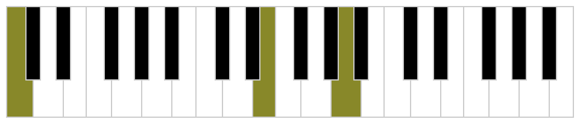
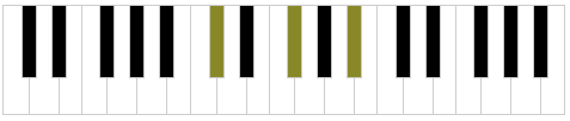
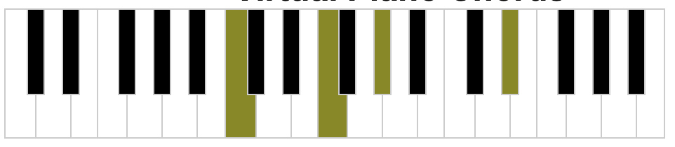

# Chord Generator

This is a basic rust terminal application that gives the user the ability to create a `.wav` file with a chord of their choosing.

The user must specify the wave format used: sine, saw, or square.

## Usage

### Building a chord

The program has the capability to build chords from C4 to C5 (chromatically inclusive).
The constraints of the program means the user must use the flat enharmonic of each note if an accidental is involved (e.g. F# is Gb).
The user can specify whether they would like the note built from middle C (C4) as a base, or whether that note should be up the octave (notated by prefixing the note with a "u").

#### Examples

`cargo run sine A C E` (note how middle C is lower than A and E)

`cargo run sine Gb Db Bb`

`cargo run sine F Ab uC uEb`

### Wave types

`cargo run sine Bb D F`

`cargo run saw Bb D F`

`cargo run square Bb D F`
