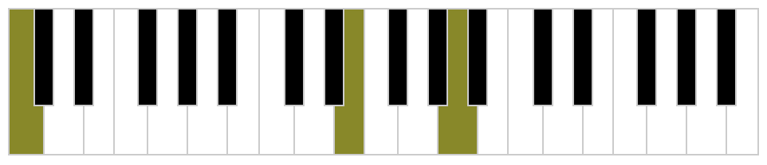
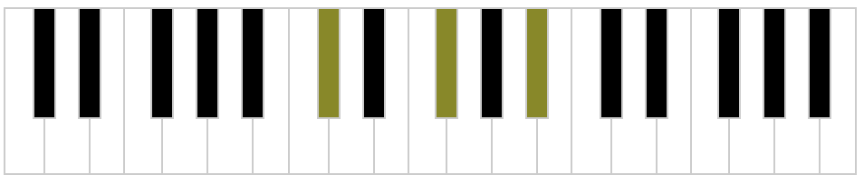
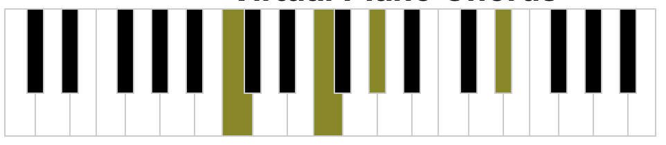

# Chord Generator

This is a basic rust terminal application that gives the user the ability to create a `.wav` file with a chord of their choosing.

The user must specify the wave format used: sine, saw, or square.

## Usage

### Installing the binary

`cargo install --path .`

### Wave types

`chord-generator generate sine Bb D F`

`chord-generator generate saw Bb D F`

`chord-generator generate square Bb D F`

### Generate a chord

The `generate` command has the capability to build chords from C4 to C5 (chromatically inclusive).
The user must use the flat enharmonic of each note if an accidental is involved (e.g. F# is Gb).
The user can specify whether they would like the note built from middle C (C4) as a base, or whether that note should be up the octave (notated by prefixing the note with a "u").

#### Examples

`chord-generator generate sine A C E` (note how middle C is lower than A and E)

`chord-generator generate sine Gb Db Bb`

`chord-generator generate sine F Ab uC uEb`

### Morph between two chords

`chord-generator morph square Db uE Ab Gb --to F uA uG Eb --duration 10`
